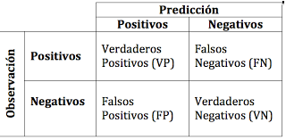

Esta son las métricas para evaluar una regresión, pero en nuestro ejemplo la variable respuesta es una variable binomial, por lo tanto es un problema de clasificación y no de regresión. Existen otro tipo de métricas para poder evaluar un método de estimación cuando el problema es de predicción, entre ellos los más conocidos son **precision** y **recall**. Para observar esto miremos lo que se conoce como matriz de confusión.

Entonces la precision o valor predictivo positivo  va medir a todos aquellos a los que predecimos como positivos y es verdad (verdaderos positivos) sobre todos los que predecimos como verdaderos. Más formal $VP/(VP+FP)$.

El recall o sensibilidad va medir a todos los verdaderos positivos sobre todos los que son positivos realmente. Más formal $VP/(VP+FN)$

La especificidad o razon de verdaderos negativos mide todos aquellos que son verdaderos negativos sobre todos los negativos reales. Más formal $VN/(FP+VN)$

Estos indicadores deben estar balanceados entre sí, no se puede intentar mejorar solo uno. Por ejemplo si aumentamos la precisión llevandola a 1, significa que acertamos a todos los que son verdaderamente positivos, pero esto, probablemente traiga aparejada que tenemos muchos falsos positivos también, por lo tanto puede ser indicio de sobre ajuste (*overfitting*). En cambio si mejoramos el recall, procurando no tener falsos negativos, puede dar indicios de sub-ajuste (*underfitting*).

Existe unfa fórmula que los unifica a la precision y al recall para trabajar de manera unificada, estos se conocen como las medidas $F_1$. En este caso la fórmula es la siguiente:
$$
F_1 = \frac{2}{1/prec+1/rec}
$$

Este indicador va de 0 a 1 siendo 1 el mejor resultado.